  

# Awesome Agricultural Carbon Management 🌾 Track & Measure Farm Soil Carbon & MRV

> 🌍 **Curated List of SaaS Platforms & Open-Source GitHub Projects for Agricultural Carbon Management, Soil Carbon MRV (Measurement, Reporting, and Verification), Farm Carbon Credits, Regenerative Agriculture, and Carbon Marketplaces.**

---

## 📑 Table of Contents
- [📊 Market Overview & Industry Dynamics](#-market-overview--industry-dynamics)
- [🏢 SaaS & Commercial Platforms](#-saas--commercial-platforms)
- [🔓 Open-Source GitHub Projects](#-open-source-github-projects)
- [🤝 How to Contribute](#-how-to-contribute)
- [💖 Support & Sponsorship](#-support--sponsorship)
- [⚠️ Disclaimer](#%EF%B8%8F-disclaimer)
- [📈 Star History](#-star-history)

---

## 📊 Market Overview & Industry Dynamics

> 📈 **Estimated Market Size**: The global Agricultural Carbon Management & Soil MRV market is estimated at **$2.4 Billion in 2026** and is projected to expand to **$6.8 Billion by 2032** (CAGR ~19.2%), driven by corporate Scope 3 decarbonization commitments, compliance registries, and expanding farm practice transitions.

> 🧩 **Market Fragmentation**: The sector is currently **moderately to highly fragmented**. While early leaders like Indigo Ag and Regrow Ag have scaled commercial grower networks, rapid innovations in Earth Observation (EO), soil biogeochemical modeling, and regional MRV protocols prevent a single "winner-take-all" outcome, leaving ample room for specialized regional, crop-specific, and open-source solutions.

---

## 🏢 SaaS & Commercial Platforms

Commercial platforms dominate farm grower enrollment, satellite-driven soil carbon measurement, carbon credit issuance, and enterprise Scope 3 carbon reporting.

Below is a curated comparison of leading commercial agricultural carbon platforms, sorted by **estimated company scale / valuation (descending)**:

| Platform 🚀 | Primary Focus & Features 🎯 | Est. Scale / Valuation 💎 | Pricing Tier 💵 | Free Tier / Trial Limit 🎁 |
| :--- | :--- | :--- | :--- | :--- |
| **[Indigo Ag](https://www.indigoag.com/)** 🌾 | Soil carbon credit generation, scope 3 emissions tracking, microbial seed treatment, & carbon registry integration. | **$3.5 Billion** (Peak Valuation) | Custom enterprise quote (typically revenue share or $15–$30/acre credit revenue split) | No free tier; demo & custom grower enrollment trial on request |
| **[Regrow Ag](https://www.regrow.ag/)** 🛰️ | DNDC-based soil carbon modeling, crop monitoring, & corporate Scope 3 ecosystem decarbonization. | **$500 Million** (Est. Valuation / Series B) | Enterprise annual licensing starting at **$25,000/year** + per-acre pricing (~$1.50–$3.00/acre) | 14-day enterprise pilot / sample dataset access upon demo request |
| **[Pachama](https://pachama.com/)** 🌲 | AI & satellite remote sensing MRV for forest and agricultural soil carbon credit verification & marketplace. | **$315 Million** (Series B Valuation) | Transaction fee model starting at **10%–15%** per verified carbon credit traded | Free account access to browse verified carbon project analytics |
| **[Agreena](https://agreena.com/)** 🚜 | Europe's leading soil carbon program issuing accredited carbon certificates for regenerative farming practice changes. | **$170 Million** (Series B Valuation) | Performance fee of **15%** on issued carbon certificates or €50–€100/hectare payout option | Free farm eligibility calculation & satellite field boundary mapping |
| **[Perennial](https://www.perennial.earth/)** 🌍 | Direct soil organic carbon (SOC) measurement using remote sensing, ML, & spatial soil core calibration. | **$60 Million** (Est. Scale / Series A) | API access starting at **$0.50–$1.20/acre** monitored per year | Demo sandbox environment with 500-acre test sample data |
| **[Agoro Carbon Alliance](https://agorocarbonalliance.com/)** 🤝 | Farmer incentive programs, agronomist consultation, & long-term soil carbon sequestration contracts. | **$50 Million** (Backed by Yara International) | Profit-share model (farmers retain ~70%–80% of generated credit market value) | Free baseline soil assessment for qualified acreage (>500 acres) |
| **[Downforce Technologies](https://www.downforce.tech/)** 📉 | High-resolution soil organic carbon assessment & natural capital quantification platform without ground hardware. | **$25 Million** (Est. Valuation / Seed+) | Annual subscription starting at **£5,000/year** for up to 10,000 hectares | Free initial 1,000-hectare trial scan report |
| **[Nori](https://nori.com/)** 🪙 | Blockchain-based regenerative agriculture carbon removal marketplace issuing Nori Carbon Removal Tonnes (NRTs). | **$20 Million** (Est. Valuation / Series A) | Fixed **$2.00 fee per NRT** (ton of CO2e) traded on marketplace | Free grower enrollment & baseline evaluation; $0 upfront cost |
| **[CarbonSpace](https://carbonspace.ai/)** 🌌 | Satellite-based GHG footprint estimation tool for cropland, pasture, & supply chain carbon intensity scoring. | **$12 Million** (Est. Scale / Seed) | SaaS tier starting at **€490/month** for baseline spatial GHG monitoring | 14-day free trial with 1 target field spatial analysis |

---

## 🔓 Open-Source GitHub Projects

Open-source tools provide transparent, reproducible codebases for research MRV workflows, satellite remote sensing indices, soil carbon statistics, and farm-scale emission calculators.

Below is the complete catalog of open-source projects, sorted by **GitHub Stars_Count (descending)**:

* **[ML-in-Agriculture](https://github.com/AkshanshChahal/ML-in-Agriculture)**  🤖  
  *Prediction of Crop Yield for farmers based on weather, soil health, and satellite data using Machine Learning models.*

* **[Crop-Yield-Prediction-Using-Satellite-Imagery](https://github.com/meet-sapu/Crop-Yield-Prediction-Using-Satellite-Imagery)**  🛰️  
  *Satellite-based deep learning pipelines analyzing multispectral Sentinel-2 imagery for crop productivity and biomass estimation.*

* **[Satip](https://github.com/openclimatefix-archives/Satip)**  ☁️  
  *Open Climate Fix tool for retrieving, transforming, and storing satellite EUMETSAT data for climate and solar/crop forecasting.*

* **[Crop Yield Prediction via Weather & NDVI](https://github.com/abhiwagh95/Crop-yield-prediction-using-weather-data-and-NDVI-time-series)**  📊  
  *Calculates NDVI time-series from Sentinel-2 satellite imagery combined with meteorological data for regional crop yield optimization.*

* **[FAO SOC Mapping Cookbook](https://github.com/FAO-SID/SOC-Mapping-Cookbook)**  📖  
  *Official FAO code repository and recipes for national digital mapping of Soil Organic Carbon (SOC) stocks and spatial change detection.*

* **[DVM-DOS-TEM](https://github.com/uaf-arctic-eco-modeling/dvm-dos-tem)**  🌲  
  *Process-based Dynamic Vegetation, Dynamic Organic Soil, Terrestrial Ecosystem Model for ecosystem carbon flux modeling.*

* **[Crop Yield Prediction Remote Sensing](https://github.com/Beckybams/Crop-Yield-Prediction-with-Remote-Sensing-)**  🌾  
  *Estimates agricultural productivity using satellite vegetation indices, weather patterns, and soil feature engineering.*

* **[EY Crop Forecasting Challenge](https://github.com/association-rosia/crop-forecasting)**  🍚  
  *Integration of Microsoft Planetary Computer satellite images and meteorological data for predicting paddy rice yields.*

* **[SOC-DRaHR](https://github.com/ISCN/SOC-DRaHR)**  🧪  
  *Soil Organic Carbon Data Recovery and Harmonization tools developed for international soil carbon dataset standardization.*

* **[CNN-LSTM for Digital Soil Mapping](https://github.com/zlxy9892/CNN-LSTM_for_DSM)**  🧠  
  *Deep learning CNN-LSTM model for predicting Soil Organic Carbon (SOC) content using long time-series MODIS phenological variables.*

* **[ML Digital Soil Carbon Mapping](https://github.com/chinilin/SOC)**  🗺️  
  *Large-scale digital mapping of soil organic carbon content using machine learning algorithms and environmental covariates.*

* **[Satellite Rice Yield Estimation](https://github.com/nimaa66/Crop-Yield-Estimation)**  🌾  
  *Combines Google Earth Engine (GEE) MODIS remote sensing data with XGBoost and Random Forest algorithms for farm yield forecasting.*

* **[Farmland Anomalies Segmentation](https://github.com/amogh7joshi/farmland-anomalies)**  🛰️  
  *Computer vision segmentation of destructive farmland anomalies from satellite imagery to safeguard crop yields.*

* **[Soils Revealed Platform](https://github.com/Vizzuality/soils-revealed)**  🌏  
  *Interactive visual analysis and reporting platform tracking past, current, and future soil organic carbon changes under climate scenarios.*

* **[Soil Carbon Statistics Simulator](https://github.com/spertus/soil-carbon-statistics)**  📐  
  *R statistical simulations testing soil organic carbon sampling design, baseline variance, and agricultural treatment effects.*

* **[Soil Spectroscopy SOC Prediction](https://github.com/eupassarinho/soil-carbon-and-spectroscopy-with-PLS-and-LASSO)**  🔬  
  *Predicting soil organic carbon using visible, near-infrared (VNIR) and mid-infrared (MIR) spectral libraries with PLS and LASSO.*

* **[AgroVision Precision Ag](https://github.com/mwasifanwar/agrovision-precision)**  🛸  
  *Multispectral drone and satellite computer vision pipelines monitoring soil health, crop disease, and yield prediction.*

* **[Open Farm Carbon Tracker](https://github.com/euraf/OpenFarmCarbonTracker)**  🚜  
  *Open-source diagnostic software for farm-scale greenhouse gas emissions accounting and agricultural carbon baseline modeling.*

* **[Carbon MRV Prototype](https://github.com/atnahm/Carbon-MRV-Prototype)**  🧩  
  *AI-assisted prototype platform for agricultural carbon accounting, practice verification, and MRV data aggregation.*

* **[GreenChain MRV & Credit Marketplace](https://github.com/Simplyaksh18/GreenChain)**  ⛓️  
  *Mobile-first carbon MRV and credit marketplace connecting smallholder farm evidence with satellite verification and SOC analysis.*

* **[Farm2Credit](https://github.com/gracevarshinik-stack/Farm2Credit)**  💡  
  *Smallholder farmer carbon credit issuance platform using satellite MRV and transparent practice verification.*

* **[MRV for SOC Regional Platform](https://github.com/climatecarbonlanduse/MRV_for_SOC_article)**  🇸🇪  
  *Regionalized monitoring, reporting, and verification (MRV) code for tracking soil organic carbon (SOC) changes in European agriculture.*

* **[FarmStack](https://github.com/FarmStack/FarmStack)**  🌐  
  *Open data exchange platform for agricultural data sharing, farm telemetry, and carbon MRV data interoperability.*

---

## 🤝 How to Contribute

We welcome community contributions! To add a new platform or open-source tool:

1. 🍴 **Fork** this repository.
2. 📝 **Add/Edit** entries in `README.md` following the exact table or list format.
3. 🔎 Ensure all pricing, star links, and project descriptions are factual and verifiable.
4. 📥 Submit a **Pull Request** with a brief summary of additions.

---

## 💖 Support & Sponsorship

Thank you for exploring and using this community repository! If you find this curated ecosystem list helpful for your research, enterprise MRV work, or open-source projects, please consider supporting the project:

- ⭐ **Star** this repository to increase its visibility.
- 🔀 **Fork** and share it with fellow AgTech, ClimateTech, and soil carbon researchers.
- ☕ **Buy Me a Coffee / Sponsor**: Support ongoing maintenance and curation on our [GitHub Sponsors Dashboard](https://github.com/sponsors/ishandutta2007).

---

## ⚠️ Disclaimer

- This list is **community-curated** for educational, research, and informational purposes.
- Agricultural carbon credits and MRV claims are subject to rigorous registry standards (e.g., Verra, Gold Standard, Climate Action Reserve).
- Unverified open-source models should be combined with physical soil sampling and approved methodologies prior to issuing commercial carbon credits.

---

## 📈 Star History

---

  <b>Built for Regenerative Agriculture Teams, Carbon Developers, Sustainability Officers & AgTech Engineers 🌾</b>

